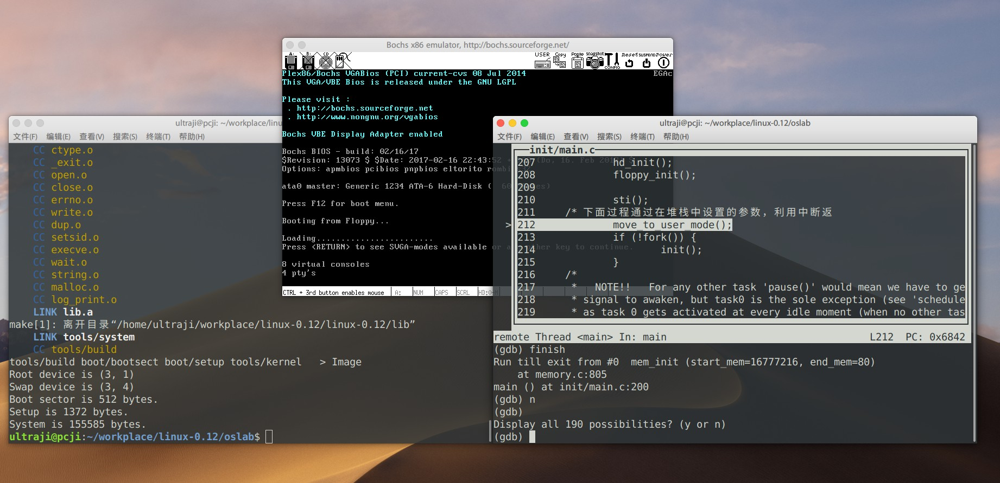

# linux-0.12 源码学习

*参考《Linux内核完全剖析 --基于0.12内核》*

1. linux-0.12目录为修改过的源代码，其中加入了**中文注释**，修改部分代码使其能在现在的环境下**编译**，并且支持**GDB调试**。

2. oslab为实验目录，切到oslab目录下，运行该目录下的`run.sh`脚本即可运行linux0.12操作系统。

## 一、实验篇



### 1.1 环境搭建

#### 1.1.1 方式一

可以选择已创建好的docker镜像作为实验环境（人生苦短，我用容器）。

1. 首先从docker hub中拉取镜像;

    ```shell
    docker pull ultraji/ubuntu-xfce-novnc:os_learn 
    ```

2. 运行容器，linux用户可以通过挂载将本地项目目录挂载到容器中，windows或mac用户可以在容器内重新git clone一份；

    ```shell
    docker run -t -i -p 6080:6080 -v ${本地项目路径}:${容器内项目路径} ultraji/ubuntu-xfce-novnc:os_learn
    ```

3. 默认不启动VNC服务，运行`/home/ubuntu`目录下`vnc_startup.sh`脚本启动VNC服务，就可以通过浏览器输入```http://localhost:6080/vnc.html```访问容器内的桌面系统了。

    - vnc登陆密码: 123456
    - 默认用户: ubuntu
    - 用户密码: 123456

#### 1.1.2 方式二

**ubuntu(64bit，>=14.04)** 的用户也可以使用`src/code`目录下的一键环境搭建脚本[setup.sh](src/code/setup.sh)。

### 1.2 如何使用

该项目的oslab为实验目录，切到oslab目录下，运行该目录下的`run.sh`脚本即可运行linux0.12操作系统。

- `-m` &emsp;编译生成新的Image镜像
- `-g` &emsp;运行bochs模拟器，与gdb联调

## 二、踩坑篇

[操作系统笔记](https://github.com/ultraji/notebook_os)
