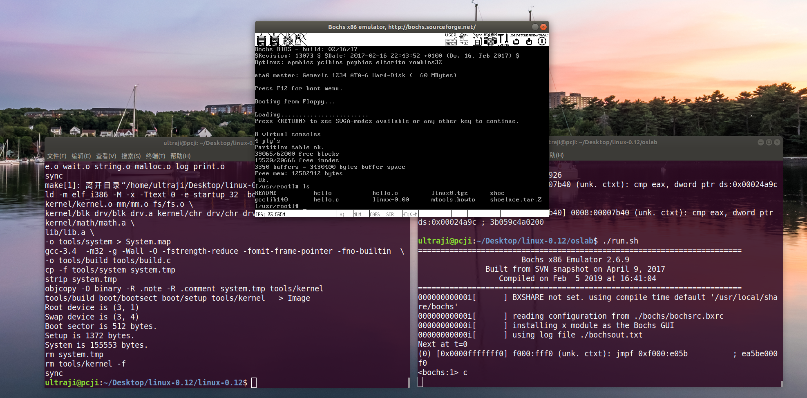

# linux-0.12 源码学习

*参考《Linux内核完全剖析 --基于0.12内核》*

linux-0.12目录为修改过的源代码，其中加入了**中文注释**，修改部分代码使其能在现在的环境下**编译**，并且支持**GDB调试**。(无任何修改的源代码 -> [linux-0.12.tar.gz](src/code/linux-0.12.tar.gz))

| 文件夹        | 说明                |
| ------------ | ------------------ |
| `linux-0.12` | 源代码 & 注释        |
| `oslab`      | 实验目录            |
| `src`        | 笔记和资源          |

## 一、实验篇



### 1.1 环境搭建

用户可以选择已创建好的docker镜像作为实验环境（人生苦短，我用容器）。

1. 首先从docker hub中拉取镜像;

    ```shell
    docker pull ultraji/ubuntu-xfce-novnc:os_learn 
    ```

2. 运行容器, 例如将本地项目`home`目录下`linux-0.12`挂载到ubuntu用户的桌面下（不建议在windows或mac下进行挂载，可以在容器内重新git clone一份）；

    ```shell
    docker run -t -i -p 6080:6080 -v /home/ultraji/linux-0.12:/home/ubuntu/Desktop/linux-0.12 ultraji/ubuntu-xfce-novnc:os_learn
    ```

**注**： 默认不启动VNC服务, 运行`home/ubuntu`目录下`vnc_startup.sh`脚本启动VNC服务。开启vncserver后就可以通过浏览器输入```http://localhost:6080/vnc.html```访问桌面系统了。

    - vnc登陆密码: 123456
    - 默认用户: ubuntu
    - 用户密码: 123456

**ubuntu(64bit，>=14.04)** 的用户也可以使用`src/code`目录下的一键搭建脚本[setup.sh](src/code/setup.sh)。

选项说明：

- `-e` &emsp;安装编译环境(gcc-3.4，bin86等)
- `-b` &emsp;安装bochs模拟器
- `-bm` &emsp;下载和编译bochs源码，生成bochs模拟器
    - `-g` &emsp;编译生成带gdb调试的bochs模拟器，例： ```./setup.sh -bm -g```

### 1.2 如何使用

该项目的oslab为实验目录， 切到oslab目录下，运行该目录下的`run.sh`脚本即可运行linux0.12操作系统。

选项：

- `-m` &emsp;编译生成新的Image镜像，例，`./run.sh -m`
- `-g` &emsp;运行bochs模拟器，与gdb联调

## 二、踩坑篇

[操作系统笔记](https://github.com/ultraji/notebook_os)
